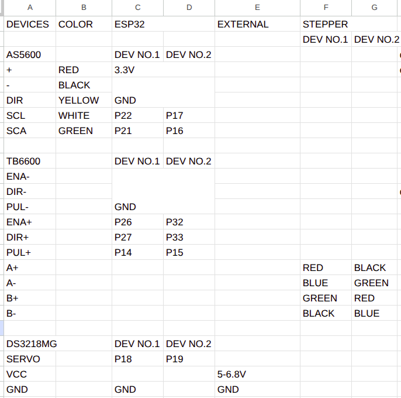

# DWAPP-N HARDWARE CONTROL
>Note: This package is test on Ubuntu 24.04 with ROS2 Jazzy

## Table of Contents
- [Install Python Library](#install-python-library)
- [Use This Package](#use-this-package)
- [Rus Ros2 Node](#run-ros2-node)
- [Set Servo Gripper Position](#set-servo-gripper-position)
- [Example Service Call](#example-service-call)
- [Wiring](#wiring)

## Install Python Library
```bash
sudo apt install python3-can
sudo apt install python3-serial
sudo apt install python3-yaml
sudo apt install python3-pynput
```

## Use This Package
1. Clone repo
    ```bash
    cd ~
    git clone https://github.com/phattanaratjeedjeen-sudo/canbus_ws.git
    ```

2. Micro-ros install. Please follow this [link](https://github.com/phattanaratjeedjeen-sudo/MICRO_ROS)

    >Note:
    >- Workspace: canbus_ws
    >- Project name: stepper_control

3. Build package
    ```bash
    cd ~/canbus-ws
    colcon build && source install/setup.bash
    ```

4. Setup environment
    ```bash
    echo "source ~/canbus_ws/install/setup.bash" --> ~/.bashrc
    source ~/.bashrc
    ```

## Run ros2 node 
** Before run any node user must stay at `~/canbus_ws` and open `new terminal` everytime
1. Run teleop node. If using web interface is prefered. Skip this node
    ```bash
    # make sure using X11 not waylan
    ros2 run hardware_control teleop_jog.py 
    ```

2. Run motor control node
    ```bash
    ros2 run hardware_control motor_control.py
    ```

3. Run micro-ros agent
    ```bash
    ros2 run micro_ros_agent micro_ros_agent serial --dev /dev/serial/by-id/usb-1a86_USB_Serial-if00-port0
    ```


## Wiring

